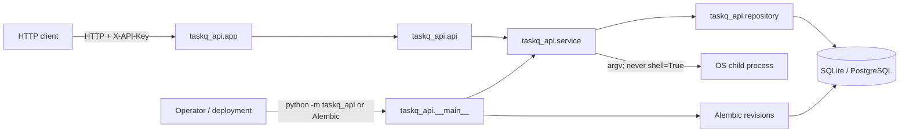
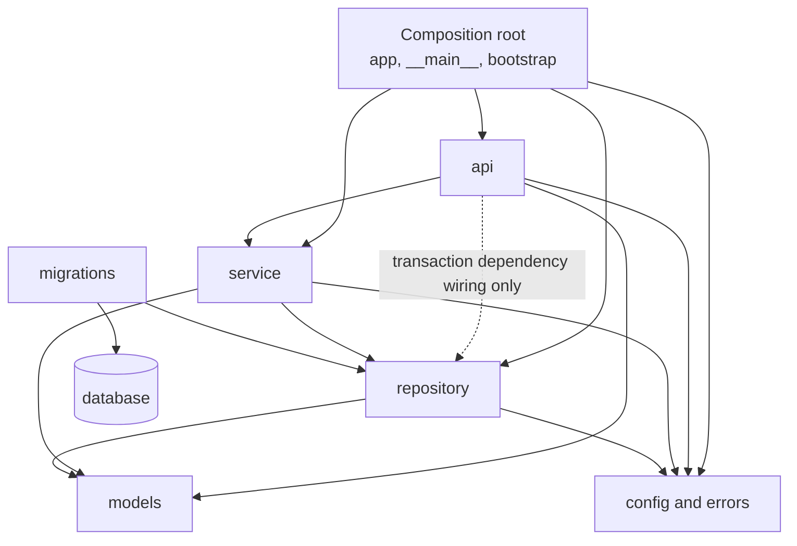
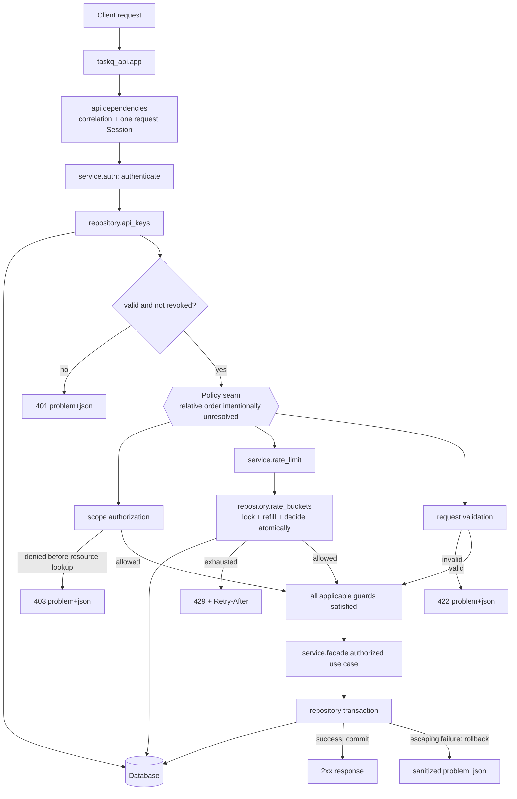
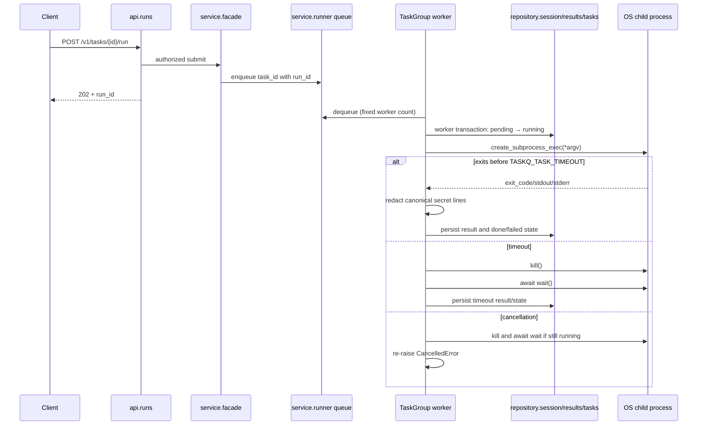
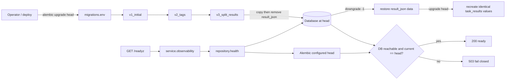

# Software Architecture Document (SAD) — `taskq-api`

| Field | Value |
|---|---|
| Document status | Phase 2 architecture baseline draft |
| Canonical requirements | `SPEC.md` v1.0.0 and `01-requirements/SRS.md` |
| Runtime | Python 3.11, FastAPI ASGI, SQLAlchemy 2.x, Alembic |
| Deployment entry points | `uvicorn taskq_api.app:app`; `python -m taskq_api` |

## 1. Overview

### 1.1 Purpose and architectural drivers

`taskq-api` exposes task CRUD, execution, run history, health, readiness, and metrics over HTTP while persisting state in SQLite for development/tests and PostgreSQL for production. The architecture is driven by five binding concerns:

1. preserve the `api > service > repository > models` import direction;
2. keep SQLAlchemy and transaction ownership inside `repository/`;
3. authenticate callers, enforce required scope before resource lookup, and apply a persistent atomic per-token rate limit without inventing failed-request accounting;
4. bound asynchronous subprocess execution and drain it safely on shutdown; and
5. evolve the relational schema through three reversible Alembic revisions, including the v3 data move.

The system is a layered modular monolith. It uses one ASGI process boundary, one relational database boundary, and OS child processes for task commands. No network broker, cache, or separate worker service is introduced because none is required by the canonical specification.



### 1.2 System boundaries and ownership

| Boundary | Inside | Outside | Ownership rule |
|---|---|---|---|
| HTTP | ASGI app, middleware, routes, dependencies | Clients and proxies | Treat headers, path/query values, and bodies as untrusted. |
| Database | Repository API and transaction manager | SQLite/PostgreSQL engine | Only the `repository/` application layer imports SQLAlchemy; Alembic migration code is deployment tooling outside the four-layer application contract and may use SQLAlchemy to define revisions. |
| Subprocess | Bounded runner and redaction pipeline | Executed command and its output | Pass an argv vector to `create_subprocess_exec`; kill and reap on timeout. |
| Operations | CLI, readiness, migration checks | Operator and deployment system | Readiness fails closed when DB or migration head checks fail. |
| Observability | Correlation, problem responses, logs, metrics | Log sinks and API consumers | Redact canonical secret patterns before persistence or emission. |

### 1.3 System verification target

The required `Makefile` target is `verify-system`. It must fail on any failed step and must execute the delivered entry points rather than only chaining static checks. Its ordered system path is:

1. run `alembic upgrade head` against a real temporary database;
2. run the complete test suite;
3. start `uvicorn taskq_api.app:app` and smoke-test `/healthz` and `/readyz`;
4. execute `alembic downgrade base` followed by `alembic upgrade head`; and
5. print `verify-system: PASS` only after all preceding commands succeed.

This exercises the real ASGI composition root, repository/session wiring, database migrations, and operational endpoints required by NFR-12.

### 1.4 Canonical gaps retained without invention

The canonical `SPEC.md` numbering jumps from §5 to §7 and contains no standalone §6 directory tree. Therefore §2 below derives only from the binding layer order in NFR-06, the prescribed entry points and paths, and the four named high-risk modules. If a canonical SPEC §6 is restored, this tree requires a cross-check before implementation.

The following SRS §7 issues remain decisions for stakeholder resolution; this SAD does not silently choose an interpretation:

| Open issue | Architectural containment |
|---|---|
| FR-01 field-to-validation-rule and blacklist mapping | `models.schemas` owns request validation, but the unresolved rule set is not encoded here. |
| FR-02 stdout/stderr tail length and unit | `service.redaction` precedes persistence; truncation policy remains unspecified. |
| FR-08 `interrupted` versus the stated terminal-state set | `service.runner` exposes shutdown interruption distinctly; the final persisted representation remains unresolved. |
| FR-05 SQLite versus row-level locking, plus failed-request accounting and ordering | `repository.rate_buckets` owns one atomic consume operation; dialect-specific serialization and the relative order of rate limiting, authorization, and validation—including whether a later failure consumes a token—require canonical confirmation and an ADR before implementation. |
| FR-07 v1 two-table statement versus `rate_buckets`/`result_json` schema rows | Revision files are reserved, but their v1 contents must not be finalized before resolution. |
| FR-09 unnamed metrics percentile set | `service.observability` owns percentile calculation without selecting an unstated set. |
| NFR-02 repository-wide wording versus source-only grep command | Both scan scopes remain visible in verification planning; neither is weakened here. |

## 2. Module Design

### 2.1 Layering and dependency rules



Binding dependency rules:

- Runtime imports flow downward only: `api → service → repository → models`.
- `api.dependencies` may import `repository.session` solely to establish a request-scoped repository context; handlers never issue data operations directly.
- `service` receives repository interfaces/objects and never receives or imports a SQLAlchemy `Session`.
- SQLAlchemy declarative mappings live in `repository.orm`, not `models`, so the forbidden SQLAlchemy import contract is enforceable outside `repository/`.
- `models` contains pure domain enums/entities and Pydantic transport models; it does not import an upper layer.
- `repository` operation modules import the repository-local `session` hub for query/mutation helpers and `orm` for mappings. The hub imports no operation module; `bootstrap` constructs repository objects, so these internal calls create no cycle.
- `models.domain` and `models.schemas` may call pure coercion functions in `models.common`; `schemas` may call domain factories, while neither `common` nor `domain` imports `schemas`.
- `config` and `errors` import no application layer and do not import each other. All layers may depend on them.
- `migrations/` is deployment tooling, not one of the canonical `api > service > repository > models` application layers governed by the layers contract. `migrations/env.py` may load `repository.orm` metadata, and immutable Alembic revisions may use SQLAlchemy schema types. Each revision keeps its schema/data operations locally and may call only the frozen `migrations.versions` helper hub; the hub never imports revision scripts, runtime services, or API code. No non-`repository` application layer imports SQLAlchemy.
- Reverse imports and runtime imports from a lower layer to a higher layer are forbidden. These rules form a directed acyclic graph; no circular dependency is permitted.

### 2.2 Planned directory structure

The required delivery paths and source tree are shown below; existing requirements/architecture documents and harness-owned files are omitted from this implementation view. Every application source directory remains below the NFR-11 limit of 15 files, and each source file remains at most 400 lines.

```text
.
├── .env.example
├── .importlinter
├── Makefile
├── alembic.ini
├── requirements.txt
├── requirements.lock
├── requirements-dev.txt
├── .methodology/
│   └── harness_config.json
├── 08-config/
│   └── SBOM.json
├── migrations/
│   ├── __init__.py
│   ├── env.py
│   ├── script.py.mako
│   └── versions/                          # 3 revision files + 1 frozen helper hub
│       ├── __init__.py                    # revision_context/operations_for hub; not a revision
│       ├── v1_initial.py
│       ├── v2_tags.py
│       └── v3_split_results.py
└── 03-development/
    ├── src/taskq_api/                     # 6 files
    │   ├── __init__.py
    │   ├── __main__.py                    # management CLI adapter
    │   ├── app.py                         # required ASGI symbol: app
    │   ├── bootstrap.py                   # package-root composition hub
    │   ├── config.py                      # independent settings module
    │   ├── errors.py                      # independent typed error taxonomy
    │   ├── api/                           # 7 files
    │   │   ├── __init__.py
    │   │   ├── dependencies.py            # API hub: public/protected request context
    │   │   ├── tasks.py                   # task CRUD routes
    │   │   ├── runs.py                    # run submission/history routes
    │   │   ├── health.py                  # health/readiness routes
    │   │   ├── metrics.py                 # admin metrics route
    │   │   └── problems.py                # RFC 7807 handlers
    │   ├── service/                       # 8 files
    │   │   ├── __init__.py
    │   │   ├── facade.py                  # service orchestration hub
    │   │   ├── tasks.py                   # task use cases and state transitions
    │   │   ├── runner.py                  # TaskGroup, queue, subprocess lifecycle
    │   │   ├── auth.py                    # key hashing/authentication/scope policy
    │   │   ├── rate_limit.py              # token-bucket decision logic
    │   │   ├── observability.py           # readiness and metrics calculations
    │   │   └── redaction.py               # canonical whole-line redaction
    │   ├── repository/                    # 8 files
    │   │   ├── __init__.py
    │   │   ├── session.py                 # transaction + repository operation hub
    │   │   ├── orm.py                     # SQLAlchemy declarative mappings
    │   │   ├── tasks.py
    │   │   ├── results.py
    │   │   ├── api_keys.py
    │   │   ├── rate_buckets.py
    │   │   └── health.py
    │   └── models/                        # 4 files
    │       ├── __init__.py
    │       ├── common.py                  # model hub: Scope and TaskStatus
    │       ├── domain.py                  # persistence-neutral entities
    │       └── schemas.py                 # Pydantic request/response contracts
    └── tests/
        ├── unit/{api,service,repository}/  # split so each directory stays ≤15 files
        ├── integration/{http,migrations,runtime}/
        └── performance/
```

Cohesion and size controls:

| Community | Hub or pipeline | Internal edge plan | Guardrail |
|---|---|---|---|
| package root | `bootstrap.py` | `app.py` and `__main__.py` call bootstrap functions; bootstrap composes `config`, `errors`, API, service, and repository providers. | Composition only; no business logic. |
| `api/` | `dependencies.py` | Every route function calls either the protected or public request-context dependency; all protected `/v1` routes use the same authorization dependency factory. | Handlers ≤40 lines. |
| `service/` | `facade.py` | API calls the façade; each façade operation calls the relevant sibling use-case module. Runner output also calls `redaction`. | Façade only orchestrates and does not absorb algorithms. |
| `repository/` | `session.py` (`fetch_one`, `fetch_all`, `execute_change`) | Every accessible operation body in `tasks`, `results`, `api_keys`, `rate_buckets`, and `health` makes a standalone call to the appropriate `session` helper; mutation paths also call `execute_change`. `session` does not import those siblings. | SQLAlchemy remains local to this directory; helpers centralize execution, not business rules. |
| `models/` | `common.py` (`coerce_scope`, `coerce_task_status`) | Every explicit validator/converter body in `domain.py` and `schemas.py` makes a standalone call to the appropriate `common` coercion function; schema-to-domain converters also call sibling domain factories. Declarative records with generated methods add no artificial calls. | Pure coercion and value semantics only; no persistence or service behavior. |
| `migrations/versions/` | frozen `__init__.py` (`revision_context`, `operations_for`) | Every revision `upgrade()` and `downgrade()` makes standalone calls to both helpers before executing its own schema/data operations; the hub validates revision/direction and supplies the online/offline Alembic operation façade but never imports a revision. | Exactly three revision scripts; helper and revisions are immutable and operations remain revision-local. |

Before implementation exit, CRG must confirm each community has at most 50 nodes and cohesion at least 0.3. If a planned module would push a directory past either cap, split that directory by cohesive responsibility rather than adding calls solely to game the graph.

### 2.3 Module responsibilities and interfaces

#### Composition and API

| Module | Responsibility | Exposed interface | Allowed dependencies |
|---|---|---|---|
| `taskq_api.bootstrap` | Build settings, repositories, runner lifecycle, routes, and handlers. | `create_app()`, `create_admin_context()` | all lower layers, `config`, `errors` |
| `taskq_api.app` | Export the required ASGI `app` object. | `app` | `bootstrap` |
| `taskq_api.__main__` | Parse `migrate`, `seed`, `healthcheck`, and `key create --scope` commands. | module execution | `bootstrap`, service façade |
| `taskq_api.config` | Validate the 12 `TASKQ_*` settings and defaults. | immutable settings object | external settings library only |
| `taskq_api.errors` | Define typed, non-HTTP application errors and safe public details. | error classes/codes | standard library only |
| `taskq_api.api.dependencies` | Establish correlation and one request-scoped session; authenticate, enforce the required scope before any resource lookup, and coordinate rate limiting through an explicit policy seam without fixing its non-canonical order or failed-request accounting. | public context; `authorize(required_scope)` dependency factory | service, `repository.session`, models, config/errors |
| `taskq_api.api.tasks` | Adapt CRUD HTTP requests/responses. | `POST/GET/DELETE /v1/tasks` | dependencies, service façade, schemas |
| `taskq_api.api.runs` | Adapt run submission/history requests/responses. | `POST /v1/tasks/{id}/run`; `GET /v1/tasks/{id}/runs` | dependencies, service façade, schemas |
| `taskq_api.api.health` | Adapt unauthenticated liveness/readiness responses. | `GET /healthz`; `GET /readyz` | public dependency, service façade |
| `taskq_api.api.metrics` | Adapt admin-only metrics response. | `GET /v1/metrics` | protected dependency, service façade |
| `taskq_api.api.problems` | Convert validation, known, and unexpected failures into sanitized RFC 7807 responses with matching correlation headers/log fields. | exception-handler registration | errors, redaction, schemas |

#### Service

| Module | Responsibility | Exposed interface | Allowed dependencies |
|---|---|---|---|
| `taskq_api.service.facade` | Thin public orchestration surface for all use cases. | CRUD, run, auth/rate, health, and metrics operations | sibling service modules, repository contracts, models |
| `taskq_api.service.tasks` | Enforce task use cases and valid state changes without holding a DB session. | create/get/list/delete and state-transition operations | repository objects, models, errors |
| `taskq_api.service.runner` | Own one queue and fixed `TaskGroup` workers; execute argv, enforce timeout/concurrency, propagate cancellation, kill/reap, and drain. | `start()`, `submit(task_id)`, `drain(timeout)` | repository scope factory, tasks, redaction, config/errors |
| `taskq_api.service.auth` | Generate keys, SHA-256 hash them, compare with `hmac.compare_digest`, reject revoked keys, and evaluate scope hierarchy. | key creation, authentication, `require_scope` | API-key repository, models, errors |
| `taskq_api.service.rate_limit` | Calculate token replenishment and retry delay, then request one atomic persisted bucket decision; the caller policy for ordering and downstream failures remains unresolved. | `consume(key_id, now)` | rate-bucket repository, config, models/errors |
| `taskq_api.service.observability` | Aggregate task counts/latencies and combine DB plus migration-head readiness. | `readiness()`, `metrics()` | repository health/tasks/results, models |
| `taskq_api.service.redaction` | Replace every line matching a canonical secret pattern with `[REDACTED]` before emission/storage. | `redact_lines(text)` | standard library only |

#### Persistence and models

| Module | Responsibility | Exposed interface | Allowed dependencies |
|---|---|---|---|
| `taskq_api.repository.session` | Configure engine/pool, own explicit request and worker transaction context managers, and provide repository-local read/write helpers without leaking `Session`. It imports no operation sibling. | `request_scope()`, `transaction()`, `worker_scope()`, `fetch_one()`, `fetch_all()`, `execute_change()` | SQLAlchemy, config/errors |
| `taskq_api.repository.orm` | Define SQLAlchemy mappings for canonical tables. | declarative metadata/mapped classes | SQLAlchemy, model enums |
| `taskq_api.repository.tasks` | Parameterized/ORM task CRUD, cursor queries, eager loading, and counts. | task repository object | session helpers, ORM, domain models |
| `taskq_api.repository.results` | Persist/query execution results in newest-first order and compute latency inputs. | result repository object | session helpers, ORM, domain models |
| `taskq_api.repository.api_keys` | Store/retrieve hashes, scopes, and revocation timestamps only. | API-key repository object | session helpers, ORM, domain models |
| `taskq_api.repository.rate_buckets` | Lock, refill, and atomically decide one per-key bucket in one transaction; return allow/retry/rejection facts without choosing request ordering or downstream failure accounting. | atomic bucket consume | session helpers, ORM, domain models |
| `taskq_api.repository.health` | Execute bounded DB connectivity and Alembic-head queries without exposing connection details. | readiness facts | session helpers, SQLAlchemy/Alembic APIs |
| `taskq_api.models.common` | Define canonical `Scope` and `TaskStatus` values plus pure coercion functions used by explicit model validators/converters. | enums/value types, `coerce_scope()`, `coerce_task_status()` | standard library only |
| `taskq_api.models.domain` | Carry persistence-neutral task, run, auth, rate, readiness, and metrics values; explicit factories call `models.common` coercion functions. | immutable domain records and factories | common models |
| `taskq_api.models.schemas` | Validate and serialize HTTP request/response contracts, including problem details; explicit validators call `models.common` and transport converters call domain factories. | Pydantic v2 models | common/domain models, Pydantic |
| `migrations.env` | Bind Alembic to configured DB and repository metadata. | Alembic online/offline environment | Alembic, SQLAlchemy, repository ORM/config |
| `migrations.versions` | Provide two frozen, statically imported revision-context helpers without containing schema evolution logic or importing revision scripts. | `revision_context()`, `operations_for()` | Alembic only |
| `migrations.versions.v1_initial` | Create the resolved v1 schema and reverse it after obtaining its operation façade from `migrations.versions`. | `upgrade()`, `downgrade()` | versions helper, Alembic, SQLAlchemy |
| `migrations.versions.v2_tags` | Add tags, join table, and unique task-name index; reverse without damaging v1 data. | `upgrade()`, `downgrade()` | versions helper, Alembic, SQLAlchemy |
| `migrations.versions.v3_split_results` | Move `result_json` data to `task_results`, remove the old field, and reverse the move losslessly. | `upgrade()`, `downgrade()` | versions helper, Alembic, SQLAlchemy |

### 2.4 Functional requirement to module traceability

Every canonical `### FR-XX:` heading maps to at least one concrete module:

| FR | Primary owner module(s) | Supporting module(s) | Architectural acceptance boundary |
|---|---|---|---|
| FR-01 | `taskq_api.api.tasks`, `taskq_api.service.tasks` | `repository.tasks`, `models.schemas`, `api.problems` | CRUD, cursor pagination, validation, eager loading, 404/409/422. |
| FR-02 | `taskq_api.api.runs`, `taskq_api.service.runner` | `repository.results`, `service.redaction`, `service.tasks` | 202 + run id, argv subprocess, timeout, result/history persistence. |
| FR-03 | `taskq_api.service.auth` | `api.dependencies`, `repository.api_keys`, `taskq_api.__main__` | Shared key authentication, hash-only storage, constant-time compare, revoke, one-time plaintext output. |
| FR-04 | `taskq_api.api.dependencies`, `taskq_api.service.auth` | `models.common`, `api.problems` | One authorization dependency, hierarchical scopes, authorization before resource lookup. |
| FR-05 | `taskq_api.service.rate_limit`, `taskq_api.repository.rate_buckets` | `api.dependencies`, `api.problems` | Per-key persisted bucket, atomic update, 429 and `Retry-After`; health routes bypass it. |
| FR-06 | `taskq_api.repository.session` | all repository modules, `repository.orm` | Repository-only access, request transaction, commit/rollback, pool settings, no string-built SQL/N+1. |
| FR-07 | `migrations.versions.v1_initial`, `v2_tags`, `v3_split_results` | `migrations.env`, `repository.orm` | Three reversible revisions, offline SQL, and lossless v3 round trip. |
| FR-08 | `taskq_api.service.runner` | `service.tasks`, `repository.session`, `repository.results` | Fixed worker count, queued excess work, TaskGroup drain, cancellation propagation, kill/reap. |
| FR-09 | `taskq_api.api.health`, `taskq_api.api.metrics`, `taskq_api.service.observability` | `repository.health`, `repository.tasks`, `repository.results` | Public liveness/readiness, fail-closed migration check, admin metrics. |
| FR-10 | `taskq_api.api.problems`, `taskq_api.errors` | `service.redaction`, `api.dependencies`, `models.schemas` | All non-2xx responses are sanitized problem details with one correlation id in body/header/log. |

### 2.5 Data ownership and transaction boundaries

- The database owns durable tasks, API-key hashes, tags, task/tag links, results, and rate buckets.
- One `repository.session.request_scope()` and therefore one SQLAlchemy `Session` exists per HTTP request. Repository-owned context managers make every transaction boundary explicit and prevent the session from escaping into the service layer.
- `bootstrap` constructs sibling repository objects with one repository-private request context. Each accessible sibling operation makes a standalone call to a `repository.session` query or mutation helper; `repository.session` imports no operation sibling, preventing a back-edge to the hub.
- The shared dependency authenticates the caller and enforces the route scope before any resource-existence lookup. It coordinates the rate-limit decision through a named policy seam, but this SAD does not order rate limiting relative to authorization or request validation.
- `SPEC.md` requires an atomic persistent per-token bucket but does not define whether 403 or later 4xx/5xx outcomes consume a token. This SAD therefore binds neither request-check ordering nor a consume/refund rule. Implementation is blocked from selecting either observable policy until canonical clarification is recorded in an ADR; only then may tests bind the confirmed behavior.
- When the resolved policy invokes it, `repository.rate_buckets` locks, refills, and decides one key's bucket inside one transaction. It returns allow/retry/rejection facts and does not decide request-level ordering or downstream-failure accounting.
- The task use-case transaction commits on successful completion and rolls back on any escaping exception. Deleting a task and its results remains atomic within that transaction.
- A runner worker uses a separate `worker_scope()` because it outlives the submitting HTTP request. Each state/result update has an explicit transaction; no SQLAlchemy session crosses an `asyncio` queue boundary.
- ORM queries use parameters and explicit `selectinload`/`joinedload`. Cursor ordering includes a stable unique tie-breaker so pages do not duplicate or omit rows.
- Migration transactions are owned by Alembic. A failed revision rolls back and leaves the prior revision active.

## 3. Interfaces and Data Flows

### 3.1 External interface catalog

| Interface | Auth/scope | Success contract | Failure contract |
|---|---|---|---|
| `POST /v1/tasks` | `write` | 201 + task id | 401/403/409/422 problem details |
| `GET /v1/tasks/{id}` | `read` | 200 + full task | 401/403/404 problem details |
| `GET /v1/tasks?status=&limit=&cursor=` | `read` | 200 + cursor page; default 50, max 200 | 401/403/422 problem details |
| `DELETE /v1/tasks/{id}` | `admin` | 2xx after atomic task/result deletion | 401/403/404 problem details |
| `POST /v1/tasks/{id}/run` | `write` | 202 + `run_id` | 401/403/404 problem details |
| `GET /v1/tasks/{id}/runs` | `read` | 200 + newest-first history | 401/403/404 problem details |
| `GET /healthz` | none; no rate limit | 200 `{"status":"ok"}` | process-level failure only |
| `GET /readyz` | none; no rate limit | 200 only when DB is usable and migration is at head | 503 problem details naming the failed readiness fact |
| `GET /v1/metrics` | `admin` | task counts, execution-latency percentiles, rate-limit rejection count | 401/403 problem details |
| `python -m taskq_api key create --scope <scope>` | operator access | plaintext key printed once; hash persisted | non-zero exit with sanitized error |
| `python -m taskq_api migrate|seed|healthcheck` | operator access | action-specific zero exit | non-zero exit with sanitized error |

Every non-2xx HTTP response has media type `application/problem+json` and fields `type`, `title`, `status`, `detail`, `instance`, and `correlation_id`. The same correlation id appears in `X-Correlation-Id` and the server log.

### 3.2 Internal contracts

| Contract | Producer | Consumer | Invariant |
|---|---|---|---|
| Protected request context | `api.dependencies.authorize(required_scope)` | all `/v1` handlers | Authenticate and enforce required scope before resource lookup; call the rate-limit policy seam without prescribing its unresolved order or failed-request accounting. |
| Repository scope | `repository.session.request_scope/transaction/worker_scope` | API dependency, repository operation modules, and runner | One session per request; no raw `Session` escapes; operation bodies call repository-local execution helpers; each selected transaction commits on success and rolls back on an escaping exception. |
| Service façade | `service.facade` | API routes and CLI | Transport-neutral inputs/outputs and typed errors only. |
| Runner submission | `service.runner.submit(task_id)` | run use case | Return a unique `run_id`; queue work without creating one coroutine per submission. |
| Runner lifecycle | `service.runner.start/drain` | bootstrap lifespan | Fixed workers live in one `TaskGroup`; cancellation propagates; timeout children are killed and reaped. |
| Atomic bucket consume | `repository.rate_buckets` | `service.rate_limit` | Lock, refill, and decide one key in one database transaction; return deterministic allow/retry facts, leaving request ordering and downstream-failure accounting to the unresolved policy seam. |
| Error conversion | typed service/repository errors | `api.problems` | Map only approved details; redact before body/log output. |
| Migration metadata | `repository.orm` | `migrations.env` | Head metadata describes runtime schema; immutable revisions define transitions. |

### 3.3 Protected request and transaction flow



The fork at the policy seam is non-temporal: it records required checks but deliberately defines no relative order among rate limiting, scope authorization, and request validation. The only bound precedence is that a per-token bucket has an authenticated key identity and that scope denial occurs before resource-existence lookup. `SPEC.md` does not say whether a 403 or a later 4xx/5xx consumes or refunds a token, so neither this diagram nor the transaction design chooses that observable behavior. Canonical clarification and an ADR must select the order, bucket commit boundary, and corresponding tests before implementation. Once an authorized use case starts, its transaction commits on success and rolls back on an escaping exception. `/healthz` and `/readyz` use the public context and bypass authentication and rate limiting; `/v1/metrics` requires `admin` scope.

### 3.4 Asynchronous execution and shutdown flow



At ASGI shutdown, bootstrap stops new submissions and calls `runner.drain(TASKQ_DRAIN_TIMEOUT)`. Work finishing inside the budget persists normally. Remaining work is cleaned up and receives the unresolved FR-08 interruption representation; no child process or swallowed `CancelledError` may remain.

### 3.5 Migration and readiness flow



The offline-SQL test executes every revision path independently. The real-file SQLite round trip compares each sample field before and after v3 downgrade/upgrade; mocks and in-memory substitutes are not accepted.

### 3.6 Error and redaction flow

All known errors cross the API boundary as typed `taskq_api.errors` values. `api.problems` owns the HTTP mapping table and never serializes an exception string. Unexpected exceptions map to `/errors/internal` with a fixed safe detail. Before command output, log fields, errors, or metrics leave the process or are persisted, `service.redaction` replaces an entire matching line with `[REDACTED]` using the NFR-04 canonical pattern.

## 4. NFR Handling

### 4.1 Complete NFR traceability

| NFR | Dimension/type | Architecture handling | Verification target |
|---|---|---|---|
| NFR-01 | `performance` | Cursor pagination; eager loading; stable indexed lookup; repository query shape independent of result count; configurable pool with pre-ping. | At 10,000 rows: detail p95 <30 ms, list p95 <80 ms, and constant SQL statement count via event listener. |
| NFR-02 | `security` | Shared auth dependency; hash-only API keys; constant-time comparison; authorization before lookup; ORM/parameters only; deny-by-default CORS; argv subprocess execution; sanitized errors. | Required grep scopes, runtime 401/403/CORS/error tests, SQL construction review, and Bandit 0 HIGH/0 MEDIUM. |
| NFR-03 | `reliability` (`error_handling` dimension) | Request/worker context managers; bounded DB readiness attempt; migration transactions; explicit cancellation propagation; timeout kill then reap. | Commit/rollback tests, DB-failure 503, migration-failure rollback, cancellation and orphan-process tests; no bare/pass handlers. |
| NFR-04 | `security` | One redaction module used before result persistence and all output sinks; DB URL never enters response/log/metrics models; plaintext key exists only in CLI return path. | Canonical-pattern positive and counterexample tests, log/error/metrics leak scan, CLI and persistence inspection. |
| NFR-05 | `documentation` | Public APIs carry FR/NFR citations; each FastAPI route declares summary and description. | 100% cited public docstrings and complete `/openapi.json` metadata assertion. |
| NFR-06 | `layering` (`architecture_constraints` dimension) | Directed layer DAG; SQLAlchemy confined to repository and migrations; `config`/`errors` independent; handlers use services rather than data operations. | Canonical `.importlinter` content assertion and `lint-imports` exit 0, including negative import fixtures. |
| NFR-07 | `licensing` (`license_compliance` dimension) | Required stack only; direct pins plus full transitive lock; SBOM records direct/transitive origin. | `pip-licenses --format=json --with-system`; allowlist-only result; validate `08-config/SBOM.json`. |
| NFR-08 | `mutation` (`mutation_testing` dimension) | Mutation surface is explicitly `service/` plus `repository/`, where decisions and persistence behavior live. | Harness feature enabled with runtime-budget rationale; mutation score ≥70. |
| NFR-09 | `verifiability` (`test_assertion_quality` dimension) | Real DB migration seams, injectable clocks/process factories at module boundaries, and no architecture path requiring skipped tests. | Full suite has 0 skips/xfails/stubs, every test has a substantive assertion, source coverage 100%, traceability status matches executed evidence. |
| NFR-10 | `integration` (`integration_coverage` dimension) | ASGI composition root is importable with dependency configuration; integration tests traverse HTTP, repository, DB, runner, and shutdown paths. | ASGITransport tests, required status/scenario matrix, and integration-only source coverage ≥80%. |
| NFR-11 | `maintainability` (`readability` dimension) | Directory/file caps in §2.2; small route adapters; cohesive façade; isolated high-risk modules; no god module. | LLOC-weighted MI ≥80, per-function CC ≤10, file ≤400 lines, directory ≤15 files, handler ≤40 lines. |
| NFR-12 | `deployability` (`execute_verification_target` dimension) | Real ASGI and CLI entry points; complete environment contract; migration-aware readiness; ordered `verify-system` path in §1.3. | `.env.example` has 12 documented variables; all CLI commands/startup work; target exits 0 and prints the PASS marker. |

### 4.2 Latency, security, and cost controls

**Latency.** NFR-01 values are hard acceptance thresholds, not aspirational goals. Benchmarks use ASGI transport with 10,000 rows. Query-count invariance is verified separately from elapsed time so a fast local N+1 query cannot pass. The architecture avoids offset scans and requires eager loading and stable cursor keys.

**Security.** Security is defense-in-depth: header authentication, centralized scope authorization before resource lookup, an atomic persisted per-key token bucket, parameterized persistence, no shell interpretation, explicit CORS allowlisting, fixed RFC 7807 details, correlation, and canonical redaction. The order of rate limiting versus authorization/validation and failed-request token accounting remain explicitly deferred because the canonical requirements do not define them. §6 maps each trust boundary to at least one independently named verification test.

**Cost.** The canonical requirements specify no currency budget or deployment-volume SLO, so a monetary target is **Requires Verification** rather than invented. Resource cost is bounded by `TASKQ_DB_POOL_SIZE`, `TASKQ_MAX_CONCURRENT`, request token buckets, cursor pagination, and subprocess timeouts. The design adds no broker/cache service and uses the required SQLite/PostgreSQL pair. A deployment cost estimate cannot be validated until worker count, request volume, task duration, and PostgreSQL hosting are specified.

## 5. Software Architecture Baseline (SAB)

The machine-readable SAB below is the single source of truth for layer composition, dependency direction, NFR-to-dimension mapping, FR-to-module ownership, quality targets, and mandatory deliverables. It is parsed by `harness/core/quality_gate/sab_parser.py` and materialized into `.methodology/SAB.json` by `harness/scripts/generate_sab.py`.

<!-- SAB:START -->
```yaml
sab:
  version: "1.0"
  created_at: "2026-09-09"
  phase: 2
  project: "taskq-api"

  layers:
    - name: api
      modules:
        - "taskq_api.app"
        - "taskq_api.bootstrap"
        - "taskq_api.__main__"
        - "taskq_api.api.dependencies"
        - "taskq_api.api.tasks"
        - "taskq_api.api.runs"
        - "taskq_api.api.health"
        - "taskq_api.api.metrics"
        - "taskq_api.api.problems"
      allowed_dependencies: ["service", "repository", "models", "independence"]
    - name: service
      modules:
        - "taskq_api.service.facade"
        - "taskq_api.service.tasks"
        - "taskq_api.service.runner"
        - "taskq_api.service.auth"
        - "taskq_api.service.rate_limit"
        - "taskq_api.service.observability"
        - "taskq_api.service.redaction"
      allowed_dependencies: ["repository", "models", "independence"]
    - name: repository
      modules:
        - "taskq_api.repository.session"
        - "taskq_api.repository.orm"
        - "taskq_api.repository.tasks"
        - "taskq_api.repository.results"
        - "taskq_api.repository.api_keys"
        - "taskq_api.repository.rate_buckets"
        - "taskq_api.repository.health"
      allowed_dependencies: ["models", "independence"]
    - name: models
      modules:
        - "taskq_api.models.common"
        - "taskq_api.models.domain"
        - "taskq_api.models.schemas"
      allowed_dependencies: []
    - name: independence
      modules:
        - "taskq_api.config"
        - "taskq_api.errors"
      allowed_dependencies: []
    - name: migrations
      modules:
        - "migrations.env"
        - "migrations.versions"
        - "migrations.versions.v1_initial"
        - "migrations.versions.v2_tags"
        - "migrations.versions.v3_split_results"
      allowed_dependencies: ["repository"]

  allowed_dependencies:
    - from: api
      to: service
    - from: api
      to: repository
    - from: api
      to: models
    - from: api
      to: independence
    - from: service
      to: repository
    - from: service
      to: models
    - from: service
      to: independence
    - from: repository
      to: models
    - from: repository
      to: independence
    - from: migrations
      to: repository

  quality_targets:
    max_complexity: 10
    min_coverage: 100
    max_coupling: 0.3

  nfr_dimension_mapping: {}

  nfr_traceability:
    NFR-01:
      type: performance
      dimension: performance
      target: "GET /v1/tasks/{id} p95 < 30ms and GET /v1/tasks?limit=50 p95 < 80ms at 10,000 rows; SQL statement count per list request constant"
      module: taskq_api.repository.tasks
    NFR-02:
      type: security
      dimension: security
      target: "0 shell=True/eval(/exec( hits; 0 string-built SQL; hash-only keys with hmac.compare_digest; deny-by-default CORS; bandit 0 HIGH 0 MEDIUM"
      module: taskq_api.api.dependencies
    NFR-03:
      type: reliability
      dimension: error_handling
      target: "explicit commit/rollback per request; no bare except or except Exception: pass; CancelledError re-raised; DB failure fail-closed 503; timeout child killed and reaped"
      module: taskq_api.repository.session
    NFR-04:
      type: security
      dimension: security
      target: "every line matching the canonical secret pattern replaced with [REDACTED] before persistence/emission; DB URL never in logs, errors, or /v1/metrics"
      module: taskq_api.service.redaction
    NFR-05:
      type: documentation
      dimension: documentation
      target: "100% public docstrings with [FR-XX]/[NFR-XX] citations; every route has OpenAPI summary and description"
      module: taskq_api.api.tasks
    NFR-06:
      type: layering
      dimension: architecture_constraints
      target: "import-linter layers contract api > service > repository > models with config/errors independence; sqlalchemy imports confined to repository and migrations; lint-imports exit 0"
      module: taskq_api.repository.session
    NFR-07:
      type: licensing
      dimension: license_compliance
      target: "all runtime deps pinned with == plus full transitive lock; every license in MIT/BSD-2-Clause/BSD-3-Clause/Apache-2.0/PSF allowlist; SBOM emitted at 08-config/SBOM.json"
      module: taskq_api.config
    NFR-08:
      type: mutation
      dimension: mutation_testing
      scope_layers: ["service", "repository"]
      target: "mutation score >= 70 over service/ and repository/ with the runtime-budget rationale recorded in harness_config.json"
      module: taskq_api.service.facade
    NFR-09:
      type: testability
      dimension: test_assertion_quality
      target: "0 skipped/xfailed/stub tests; every test has at least one assert; real SQLite migration round trip with no mocks; TRACEABILITY_MATRIX VERIFIED only after execution"
      module: migrations.versions.v3_split_results
    NFR-10:
      type: integration
      dimension: integration_coverage
      target: "integration line coverage >= 80 driven through httpx ASGITransport(app); status matrix 401/403/404/409/422/429/503, migration round trip, rate-limit recovery, graceful drain"
      module: taskq_api.app
    NFR-11:
      type: maintainability
      dimension: readability
      target: "project MI >= 80; per-function CC <= 10; file <= 400 lines; directory <= 15 files; handler <= 40 lines"
      module: taskq_api.service.facade
    NFR-12:
      type: verifiability
      dimension: execute_verification_target
      target: "make verify-system exit 0 after alembic upgrade head, full test suite, /healthz + /readyz smoke, downgrade base + upgrade head round trip; prints verify-system: PASS"
      module: taskq_api.app

  advisory_only: []

  gate_score_overrides: {}

  fr_module_traceability:
    FR-01: ["taskq_api.api.tasks", "taskq_api.service.tasks"]
    FR-02: ["taskq_api.api.runs", "taskq_api.service.runner"]
    FR-03: ["taskq_api.service.auth"]
    FR-04: ["taskq_api.api.dependencies", "taskq_api.service.auth"]
    FR-05: ["taskq_api.service.rate_limit", "taskq_api.repository.rate_buckets"]
    FR-06: ["taskq_api.repository.session"]
    FR-07: ["migrations.versions.v1_initial", "migrations.versions.v2_tags", "migrations.versions.v3_split_results"]
    FR-08: ["taskq_api.service.runner"]
    FR-09: ["taskq_api.api.health", "taskq_api.api.metrics", "taskq_api.service.observability"]
    FR-10: ["taskq_api.api.problems", "taskq_api.errors"]

  architecture_constraints:
    - "no_circular_dependencies"
    - "layers_api_service_repository_models"
    - "config_and_errors_are_independence_modules"
    - "sqlalchemy_confined_to_repository_and_migrations"

  high_risk_modules:
    - "taskq_api.service.runner"
    - "taskq_api.service.auth"
    - "taskq_api.repository.session"
    - "migrations.versions.v3_split_results"

  required_artifacts:
    - ".env.example"
    - ".importlinter"
    - "requirements.txt"
    - "requirements.lock"
    - "requirements-dev.txt"
    - "alembic.ini"
    - "Makefile"
    - "08-config/SBOM.json"
    - ".methodology/harness_config.json"
```
<!-- SAB:END -->

## 6. Security Design (STRIDE-lite Threat Model)

The following block was instantiated from `render_canonical_security_template()` and only the example values/list entries were replaced with project-specific boundaries, modules, mitigations, NFRs, and single-test verifiers.

<!-- SEC:START -->
```yaml
security_design:
  version: "1.0"
  applicability: full   # full | none — none REQUIRES justification and skips the rest
  justification: ""     # required (>=20 chars) when applicability: none
  trust_boundaries:     # project-specific trust boundaries
    - id: TB-01
      name: "untrusted HTTP client to ASGI API"
      description: "headers, paths, query values, and JSON cross from unauthenticated clients into taskq_api.api"
    - id: TB-02
      name: "runtime service to relational database"
      description: "application operations cross the repository boundary into SQLite or PostgreSQL durable state"
    - id: TB-03
      name: "async runner to host subprocess"
      description: "stored task commands cross from the service runner into an operating-system child process"
    - id: TB-04
      name: "application data to responses logs persistence and metrics"
      description: "task output and diagnostic values cross from trusted runtime memory to externally observable sinks"
    - id: TB-05
      name: "operator migration command to database schema and data"
      description: "Alembic upgrade and downgrade operations cross from deployment control into durable schema and records"
  threats:              # STRIDE-lite — every boundary has at least one threat
    - id: T-01
      boundary: TB-01
      category: spoofing
      description: "a missing invalid or revoked API key is used to impersonate an authorized caller"
      mitigation: "store SHA-256 hashes only, compare with hmac.compare_digest, and reject revoked or unmatched keys"
      owner_module: "taskq_api.service.auth"
      nfr: NFR-02
      verified_by: "test_fr03_invalid_and_revoked_keys_are_rejected"
    - id: T-02
      boundary: TB-01
      category: elevation_of_privilege
      description: "a lower-scope caller probes or mutates a resource that requires a higher scope"
      mitigation: "run the shared hierarchical authorization dependency before any resource-specific lookup"
      owner_module: "taskq_api.api.dependencies"
      nfr: NFR-02
      verified_by: "test_fr04_scope_denial_precedes_resource_lookup"
    - id: T-03
      boundary: TB-01
      category: denial_of_service
      description: "an authenticated caller exceeds the configured per-token allowance and degrades service availability"
      mitigation: "lock, refill, and decide the persisted per-token bucket atomically, then return 429 with Retry-After when exhausted"
      owner_module: "taskq_api.service.rate_limit"
      nfr: NFR-02
      verified_by: "test_fr05_rate_limit_triggers_and_recovers"
    - id: T-04
      boundary: TB-01
      category: tampering
      description: "malformed task fields or pagination values alter task state outside the request contract"
      mitigation: "validate request and query values with Pydantic models and reject invalid values with a 422 problem response"
      owner_module: "taskq_api.models.schemas"
      nfr: NFR-02
      verified_by: "test_fr01_invalid_task_and_limit_are_rejected"
    - id: T-05
      boundary: TB-02
      category: tampering
      description: "crafted task or filter values are interpreted as executable SQL"
      mitigation: "confine access to repositories and use SQLAlchemy ORM or parameterized statements without string-built SQL"
      owner_module: "taskq_api.repository.tasks"
      nfr: NFR-02
      verified_by: "test_nfr02_repository_inputs_are_parameterized"
    - id: T-06
      boundary: TB-02
      category: tampering
      description: "concurrent requests race the same token bucket and admit more requests than available tokens"
      mitigation: "lock, refill, and update one bucket atomically in a single database transaction"
      owner_module: "taskq_api.repository.rate_buckets"
      nfr: NFR-02
      verified_by: "test_fr05_concurrent_consumption_never_overdraws_bucket"
    - id: T-07
      boundary: TB-03
      category: elevation_of_privilege
      description: "shell metacharacters in a stored command trigger unintended shell interpretation"
      mitigation: "split the command into argv and call asyncio.create_subprocess_exec without shell=True"
      owner_module: "taskq_api.service.runner"
      nfr: NFR-02
      verified_by: "test_fr02_metacharacters_are_not_shell_evaluated"
    - id: T-08
      boundary: TB-03
      category: denial_of_service
      description: "a timed-out command continues running and consumes process resources"
      mitigation: "apply asyncio.wait_for, kill a live child, and await process.wait before persisting timeout state"
      owner_module: "taskq_api.service.runner"
      nfr: NFR-03
      verified_by: "test_fr08_timeout_kills_and_reaps_child_process"
    - id: T-09
      boundary: TB-03
      category: denial_of_service
      description: "runner cancellation leaves a live child process or is swallowed and prevents shutdown"
      mitigation: "on cancellation kill and await any live child, then re-raise the original CancelledError"
      owner_module: "taskq_api.service.runner"
      nfr: NFR-03
      verified_by: "test_fr08_cancellation_kills_reaps_and_propagates"
    - id: T-10
      boundary: TB-04
      category: information_disclosure
      description: "API keys bearer tokens database credentials or secret-like task output leak through a sink"
      mitigation: "replace every matching line with [REDACTED] before persistence, responses, logs, or metrics emission"
      owner_module: "taskq_api.service.redaction"
      nfr: NFR-04
      verified_by: "test_nfr04_all_observable_sinks_redact_secret_lines"
    - id: T-11
      boundary: TB-04
      category: repudiation
      description: "a failed request cannot be correlated between its client response and server log record"
      mitigation: "emit one correlation id in the problem body, X-Correlation-Id header, and structured log"
      owner_module: "taskq_api.api.problems"
      nfr: NFR-02
      verified_by: "test_fr10_correlation_id_matches_body_header_and_log"
    - id: T-12
      boundary: TB-05
      category: tampering
      description: "a failed or reversed v3 migration loses or changes existing result data"
      mitigation: "use transactional reversible revisions and compare every sample field across downgrade and re-upgrade"
      owner_module: "migrations.versions.v3_split_results"
      nfr: NFR-03
      verified_by: "test_fr07_v3_round_trip_preserves_every_result_field"
```
<!-- SEC:END -->

The `verified_by` values are required test identities for the later test-specification and implementation phases. From Phase 5 onward, each must resolve to an executed test rather than a skip, xfail, or stub.
